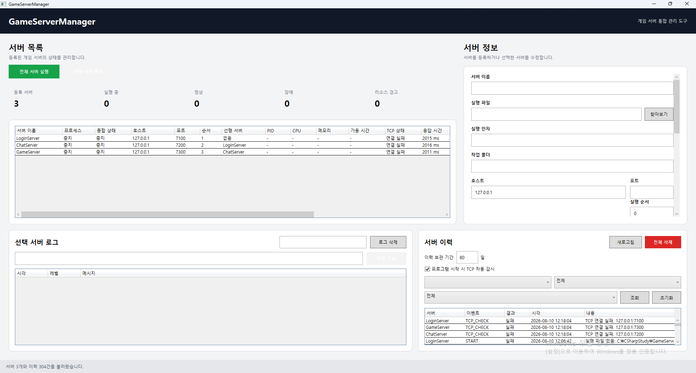

# GameServerManager

WPF 기반의 게임 서버 프로세스 통합 관리 도구입니다.

여러 게임 서버 프로세스를 등록하고 실행/종료할 수 있으며,
TCP 상태 검사, 비정상 종료 감지, 자동 재시작, 서버 의존성 관리,
실시간 로그 및 리소스 모니터링 기능을 제공합니다.

서버 설정과 이벤트 이력은 SQLite에 저장되며,
프로그램 설정은 JSON 파일로 관리합니다.

---

## Screenshot



---

## 주요 기능

### 서버 관리
- 게임 서버 등록 / 수정 / 삭제
- 실행 파일 및 작업 디렉터리 설정
- 서버별 실행 인자 설정
- Host / Port 관리
- 동일 서버명 및 Host/Port 중복 검사
- 서버 설정 SQLite 저장 및 복원

### 프로세스 관리
- 개별 서버 실행 / 종료
- 전체 서버 순차 실행
- 전체 서버 역순 종료
- PID 및 프로세스 상태 표시
- 비정상 종료 감지
- 비정상 종료 시 자동 재시작

### 서버 의존성
- 서버 실행 순서 지정
- 선행 서버 지정
- 선행 서버 TCP 정상 상태 확인 후 후속 서버 실행
- 순환 의존 관계 방지
- 의존 중인 서버 삭제 방지

### TCP 모니터링
- 서버별 TCP 연결 상태 검사
- 주기적 자동 TCP 검사
- 응답 시간 측정
- 연속 TCP 실패 횟수 관리
- 일정 횟수 이상 연결 실패 시 자동 재시작
- TCP 상태가 변경된 경우에만 이력 저장

### 서버 명령
TestGameServer를 이용하여 실행 중인 서버에 콘솔 명령을 전달할 수 있습니다.

지원 테스트 명령:

- `status`
- `players`
- `announce <message>`
- `help`
- `shutdown`
- `crash`

`shutdown`은 정상 종료,
`crash`는 비정상 종료로 구분하여 처리합니다.

### 로그 관리
- stdout / stderr 실시간 로그 수집
- 서버별 로그 분리
- 로그 검색
- 로그 자동 스크롤
- 로그 초기화

### 이벤트 이력
- SQLite 기반 서버 이벤트 이력 저장
- 서버별 필터
- 이벤트 종류별 필터
- 성공 / 실패 필터
- 이력 전체 삭제
- 오래된 이력 자동 정리
- 이력 보관 기간 설정

주요 이벤트 예:

- START
- STOP
- CRASH
- AUTO_RESTART
- TCP_RESTART
- TCP_CHECK
- COMMAND
- SHUTDOWN_COMMAND
- CPU_WARNING
- CPU_RECOVERED
- MEMORY_WARNING
- MEMORY_RECOVERED

### 리소스 모니터링
- CPU 사용률
- 메모리 사용량
- 서버 가동 시간
- CPU 경고 임계치
- 메모리 경고 임계치
- 연속 임계치 초과 감지
- 경고 및 복구 이력 저장

### 알림 및 트레이
- 시스템 트레이 아이콘
- 최소화 시 트레이 유지
- X 버튼 클릭 시 트레이로 숨김
- 트레이에서 창 복원
- 비정상 종료 알림
- 자동 재시작 알림
- CPU / 메모리 경고 알림
- 트레이 메뉴를 통한 프로그램 종료

### 대시보드
전체 서버 상태를 요약하여 표시합니다.

- 등록 서버 수
- 실행 중 서버 수
- 정상 서버 수
- 장애 서버 수
- 리소스 경고 서버 수

---

## 기술 스택

- C#
- .NET 9
- WPF
- MVVM
- SQLite
- Microsoft.Data.Sqlite
- JSON
- System.Diagnostics.Process
- TCP Socket
- Windows Forms NotifyIcon

---

## 프로젝트 구조

```text
GameServerManager
│
├─ GameServerManager.App
│  ├─ Commands
│  ├─ Data
│  ├─ Models
│  ├─ Resources
│  ├─ Services
│  ├─ ViewModels
│  └─ Views
│
├─ TestGameServer
│
└─ GameServerManager.sln
```

### GameServerManager.App
실제 게임 서버 관리 프로그램입니다.

### TestGameServer
GameServerManager의 기능을 테스트하기 위한 간단한 TCP 서버입니다.

포트 번호를 실행 인자로 전달할 수 있습니다.

예:

```shell
TestGameServer.exe 7200
```

## 데이터 저장 위치

사용자 설정 및 SQLite 데이터베이스는 다음 경로에 저장됩니다.

```shell
%LocalAppData%\GameServerManager
```

예:

```text
gameservermanager.db
settings.json
```

## 실행 방법

1. 프로젝트 빌드

```shell
dotnet build
```

2. GameServerManager 실행

Visual Studio에서 GameServerManager.App을 시작 프로젝트로 설정한 뒤 실행합니다.

3. 테스트 서버 등록

예:

```text
서버 이름: LoginServer
실행 파일: TestGameServer.exe
실행 인자: 7100
Host: 127.0.0.1
Port: 7100
실행 순서: 1
```

여러 테스트 서버를 등록할 경우 포트를 각각 다르게 지정합니다.

```text
LoginServer : 7100
ChatServer  : 7200
GameServer  : 7300
```

## 주요 구현 포인트

### 서버 상태와 프로세스 상태 분리
서버의 실행 상태와 TCP 연결 상태를 별도로 관리하고,
두 상태를 조합해 종합 상태를 표시하도록 구현했습니다.

### 서버 의존성 기반 실행
단순히 일정 시간 간격으로 서버를 실행하지 않고,
선행 서버가 실제 TCP 연결 가능 상태가 된 것을 확인한 뒤
후속 서버를 실행합니다.

### 정상 종료와 비정상 종료 구분
관리 프로그램의 종료 버튼이나 shutdown 명령으로 종료된 경우와
외부 종료 또는 crash로 프로세스가 종료된 경우를 구분합니다.

이를 통해 정상 종료에는 자동 재시작을 수행하지 않고,
비정상 종료에만 자동 재시작 정책을 적용합니다.

### TCP 상태 변화 이력
주기적인 TCP 검사는 계속 수행하지만,
동일한 결과를 매번 SQLite에 저장하지 않습니다.

연결 상태가 변경되는 시점에만 이력을 저장하여
장시간 실행 시 불필요한 데이터 증가를 방지했습니다.

### 서버별 리소스 모니터링
실행 중인 프로세스의 CPU 및 메모리 사용량을 주기적으로 조회하며,
일시적인 사용량 증가가 아닌 연속 임계치 초과를 기준으로
리소스 경고를 발생시킵니다.

---

## 개발 목적

C#과 WPF 기반 데스크톱 애플리케이션 개발을 학습하면서
프로세스 제어, TCP 통신, 비동기 처리, MVVM,
SQLite, 시스템 트레이 및 Windows 프로세스 모니터링을
하나의 프로젝트에서 다루기 위해 제작했습니다.